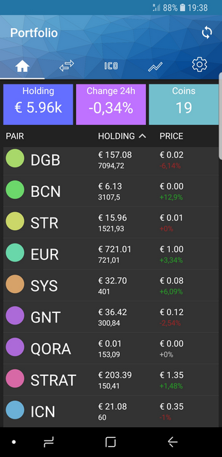
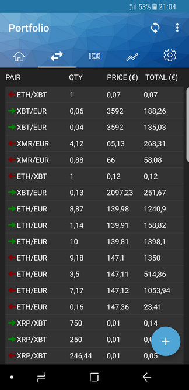
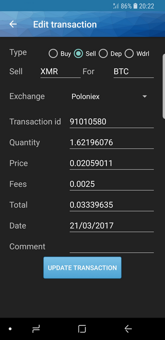
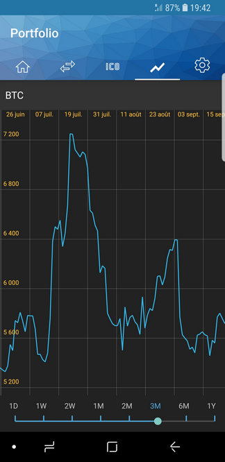
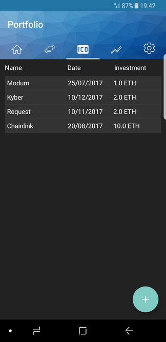
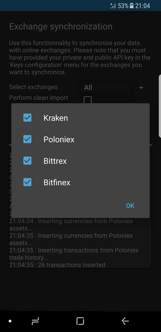
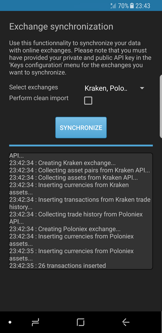
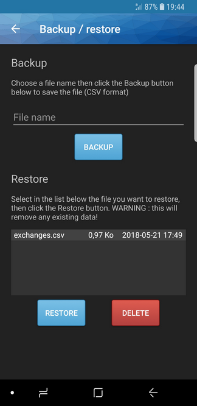
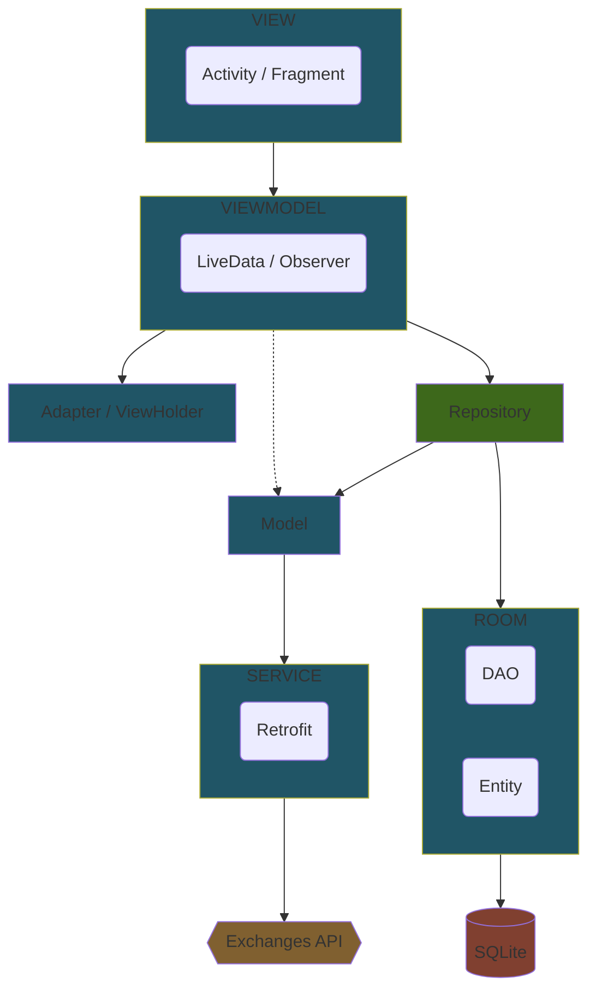

# MyCryptoBinder

**Android** application for managing **cryptocurrency** portfolio.

---

# Table of Contents

* [About the project](#about-the-project)
* [Screenshots](#screenshots)
* [Usage](#usage)
* [Technical details](#technical-details)
    * [Compatibility](#compatibility)
    * [Technologies](#technologies)
    * [Architecture](#architecture)
    * [Code structure](#code-structure)
    * [Mechanics](#mechanics)
* [Privacy](#privacy)
    * [Information we collect](#what-personal-information-do-we-collect-from-people-using-the-app)
    * [What we do with the information](#what-we-do-with-the-information-we-gather)
    * [Security](#security)
    * [Controlling your personal information](#controlling-your-personal-information)
* [License](#license)
* [Known issues](#known-issues-apr-2018)

# About the project

<table>
  <tr>
    <td>
      
    </td>
    <td>
      
    </td>
    <td>
      
    </td>
    <td>
      
    </td>
  </tr>
</table>

> [!IMPORTANT]
> DISCLAIMER
> I started this project to play around with Android architecture components for my own knowledge.
> I do not pretend the code is a reference.
> Some functionalities and checks might be missing or incomplete.
> This project is not intended to be used in a production environment.

The purpose of this application is to allow easy retrieval of trading data from online
cryptocurrency exchanges. It only allows visualization of data, it can **NOT** be used as a trading
platform.

It has been kept very simple, by gathering only trading data needed to calculate your portfolio
value and some statistics.

It is directly connected to major exchanges so you don't have to manually fill the orders.

Here is the currently supported exchanges :

- Kraken : https://www.kraken.com/
- Poloniex : https://poloniex.com/
- Bitfinex : https://www.bitfinex.com/
- Bittrex : https://bittrex.com/

# Screenshots

# Usage

1. Create API keys in your favorite exchange platform (read only recommended)
2. In the application, go to the _settings_ page, then in the _Exchanges_ menu, edit the concerned
   exchange to add the related keys (public and private)
3. Still in the settings page, click the 'synchronize' button under the _Synchronize with exchanges_
   menu
4. Enjoy a beer watching your million dollars

# Technical details

## Compatibility

- Minimum SDK : **19** (Android Kitkat)
- Targeted SDK : **27** (Android Oreo)

Main theme is based directly on the raw
[Material Theme](https://developer.android.com/training/material/theme.html) for Android 5.0
(API 21) and above, else a `Theme.AppCompat` theme is used.

Thereby the [Support libraries](https://developer.android.com/topic/libraries/support-library/index.html)
have been used for backward compatibility ([v7](https://developer.android.com/topic/libraries/support-library/packages.html#v7)).
It adds support for the Action Bar user interface design pattern and includes support for material
design user interface implementations (RecyclerView, CardView, etc.). The following ones have been used :

- [Design Support library](https://developer.android.com/training/material/design-library.html)
- [AppCompat library](https://developer.android.com/topic/libraries/support-library/packages.html#v7-appcompat)
- [CardView library](https://developer.android.com/topic/libraries/support-library/packages.html#v7-cardview)
- [RecyclerView library](https://developer.android.com/topic/libraries/support-library/packages.html#v7-recyclerview)
- [ConstraintLayout library](https://developer.android.com/reference/android/support/constraint/ConstraintLayout.html)

## Technologies

- Java 8
- [SQLite](https://www.sqlite.org) as basic embedded database
- [Android architecture components](https://developer.android.com/topic/libraries/architecture/index.html)
    - [ViewModel](https://developer.android.com/topic/libraries/architecture/viewmodel.html) helper
      class to facilitate the MVVM architecture
    - [LiveData](https://developer.android.com/topic/libraries/architecture/livedata.html) as data
      holder, to keep data up to date by respecting application lifecycle
    - [Paging](https://developer.android.com/topic/libraries/architecture/paging.html) library for
      displaying large sets of data (paged lists)
    - [Room](https://developer.android.com/topic/libraries/architecture/room.html) as persistence
      library (with singleton database instance)
- [Retrofit 2](http://square.github.io/retrofit/) as HTTP client helper (with GSON2).
  A [logging interceptor](https://github.com/square/okhttp/tree/master/okhttp-logging-interceptor) has
  also been used for logging with OkHttp 3 (Retrofit 2 completely relies on OkHttp for any network
  operation).
- [MPAndroidChart](https://github.com/PhilJay/MPAndroidChart) library for charts

## Architecture

Application has been implemented using the **MVVM** (Model-View-ViewModel) pattern as described below :

## Code structure

Application code has been organized with the following package structure :

- _activities_ : UI interaction classes
- _adapters_ : underlying views datasets management classes
- _components_ : custom components / decorators
- _dao_ : database access object interfaces
- _entities_ : database entity classes
- _helpers_ : helper classes
- _managers_ : manager classes that acts as proxy between viewmodels and daos/services
- _models_ : simple model classes (mainly used for services)
- _services_ : services classes responsible for calling web services
- _viewholders_ : view holder classes that holds view elements to speed up rendering
- _viewmodels_ : viewmodel classes that store and manage UI-related data

## Mechanics

Data got from online exchanges are stored in the local SQLite database :

- all assets from different exchanges are merged into a single `CURRENCY` table
- all trades from different exchanges are merged into a `TRANSACTIONS` table

Note: same currencies with different names are merged (ie. Kraken XBT becomes BTC).

That way we have a simple `EXCHANGE` - `CURRENCY` - `TRANSACTIONS` relation, and have no need to
call exchange API each time. Simply resynchronize the exchanges on which you performed new
operations (from the settings menu) to get up-to-date data.

# Privacy

This privacy policy sets out how we use and protect any information that you give when you use
this application.

Should we ask you to provide certain information by which you can be identified when using this
application, then you can be assured that it will only be used in accordance with this privacy
statement.

We may change this policy from time to time by updating this page. You should check this page from
time to time to ensure that you are happy with any changes.

## What personal information do we collect from people using the app?

When using this application, you may only be asked to enter your exchange public and private API
keys so we can retrieve your public and private exchange data. We will **NEVER** ask you to provide
any credit card number, wallet private key or other sensitive data.

The application may communicate with mentioned exchanges and with the
[CryptoCompare API](https://www.cryptocompare.com/api/) to get live trading data.

Thereby we may collect the following information:

- any data available from the API related to the exchange(s) you have linked
- any data you may manually enter in the app

## What we do with the information we gather

We simply use that information to display your trading data and some statistics.

We will not sell, distribute or lease any of your personal information to third parties. We will
never transmit any data about a user without obtaining its prior permission and providing
information about how and where the data will be used.

We will never display any advertising and/or send you promotional information about third parties.

## Security

Raw data is only stored in the local embedded SQLite database. Once in the app, it will never be sent
over the network to any centralized server. Keys are AES encrypted before storage.

Android Auto backup is disabled, so application data will not be sent to your Google Drive account.
If you need to backup your data, please use the backup/restore functionality from the Settings menu.

The backup/restore functionality writes CSV files to the internal storage in the application-specific
directory so it does not require any additional permission. Your keys will remain AES encrypted in
the backed up file.

I have planned to use [Android Keystore System](https://developer.android.com/training/articles/keystore.html)
in the near future to store the exchange API keys but for the moment I simply used an AES encryption.

Therefore, we cannot guarantee the security of your data as any APK file can be easily decompiled.
It's up to you to keep your application and related data in safe hands.

## Controlling your personal information

You can decide at any time to remove this application and your data will be gone with.

# License

[General Public License (GPL) v3](https://www.gnu.org/licenses/gpl-3.0.en.html)

This program is free software: you can redistribute it and/or modify it under the terms of the GNU
General Public License as published by the Free Software Foundation, either version 3 of the
License, or (at your option) any later version.

This program is distributed in the hope that it will be useful, but WITHOUT ANY WARRANTY; without
even the implied warranty of MERCHANTABILITY or FITNESS FOR A PARTICULAR PURPOSE. See the GNU
General Public License for more details.

You should have received a copy of the GNU General Public License along with this program. If not,
see <http://www.gnu.org/licenses/>.

# Known issues (Apr 2018)

- Bittrex API is broken and does not allow to retrieve order history
- Bitfinex API order history is limited to last 3 days and 1 request per minute -> use "Past
  Trades" endpoint that must be called for each pair...
- Backup / restore functionality simply backup and restore the exchanges list
- Paging need to be refactored because of deprecated methods